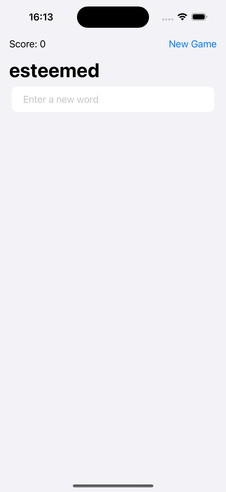
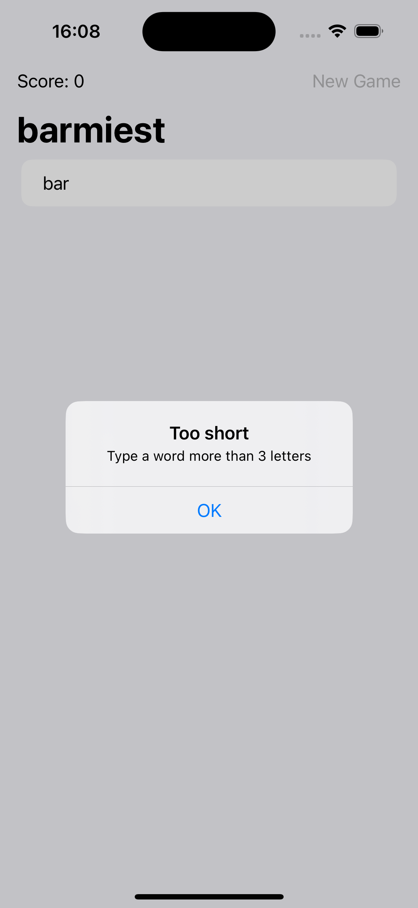
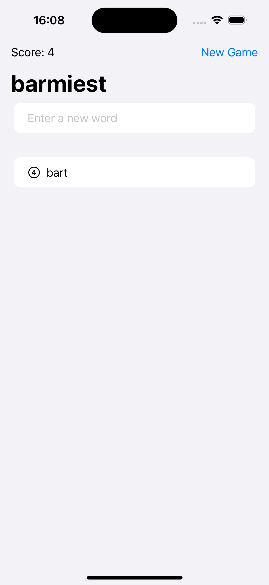

# WordScramble

WordScramble is a SwiftUI-based word game where players create new words from a given root word. The game enforces various rules to ensure the words are valid and calculates a score based on the length of the words.

## Features

- **Dynamic Word Input**: Users can enter new words via a text field.
- **Word Validation**: The app checks if the entered word:
  - Is not empty
  - Has not been used before
  - Is not the root word itself
  - Is longer than three characters
  - Can be constructed from the letters of the root word
  - Is a real English word
- **Score Calculation**: The score is updated based on the length of the valid words entered.
- **New Game**: Users can start a new game, which will load a new root word and reset the score and used words.

## Getting Started

These instructions will help you set up and run the project on your local machine for development and testing purposes.

### Prerequisites

- Xcode 12 or later
- Swift 5.3 or later

### Installation

1. Clone the repository:
    ```bash
    git clone https://github.com/OmPreetham/WordScramble.git
    ```
2. Open the project in Xcode:
    ```bash
    cd WordScramble
    open WordScramble.xcodeproj
    ```
3. Run the project on the simulator or a physical device.

## Code Overview

### `ContentView.swift`

This is the main view of the app, where the game logic is implemented.

- **State Variables**:
  - `usedWords`: An array of words used by the player.
  - `rootWord`: The current root word from which new words are derived.
  - `newWord`: The word currently being entered by the player.
  - `errorTitle` and `errorMessage`: For displaying error alerts.
  - `showingError`: Boolean to control the display of error alerts.
  - `score`: The player's current score.

- **Main UI Components**:
  - `NavigationStack`: The main container for the view.
  - `TextField`: Allows the user to input new words.
  - `List`: Displays the list of used words with their lengths.
  - `Toolbar`: Contains the score display and a button to start a new game.
  
- **Game Functions**:
  - `startGame()`: Loads a new root word and resets the game state.
  - `addNewWord()`: Validates the new word and updates the game state.
  - `isOriginal(word:)`: Checks if the word has been used before.
  - `isRootWord(word:)`: Ensures the word is not the root word itself.
  - `isShorter(word:)`: Checks if the word is at least four characters long.
  - `isPossible(word:)`: Validates if the word can be made from the root word.
  - `isReal(word:)`: Uses `UITextChecker` to ensure the word is valid.
  - `calculateScore(for:)`: Updates the score based on the word length.
  - `wordError(title:message:)`: Displays an error alert.

## Screenshots





## License

This project is licensed under the MIT License - see the [LICENSE](LICENSE) file for details.

## Acknowledgments

- The app is inspired by the word game featured in the 100 Days of SwiftUI course by Paul Hudson.
- Thanks to Apple for providing the development tools and frameworks.
